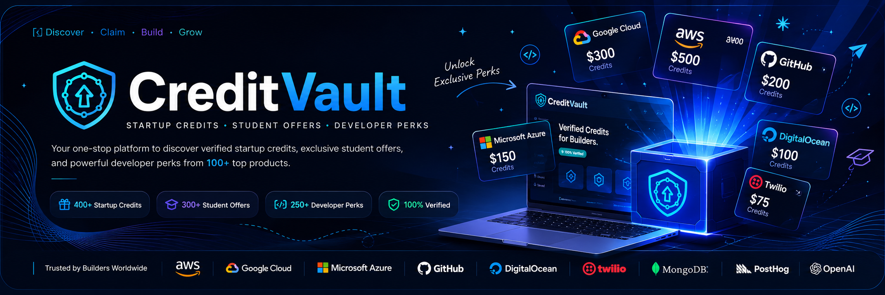

  

# CreditVault

### 🚀 The Open Source Platform for Startup Credits, Student Offers & Developer Perks

Discover verified startup credits, AI credits, cloud credits, student offers, developer tools, grants, incubators, accelerators and exclusive technology programs from official sources.

---

## 🌍 One Platform. Every Opportunity.

CreditVault is building the world's largest open-source directory for startup founders, developers, students, educators, nonprofits and open-source maintainers.

Instead of searching dozens of websites, discover every verified opportunity in one beautiful platform.

---

## ✨ Features

🚀 Startup Credits

🎓 Student Offers

🤖 AI Credits

☁️ Cloud Credits

💻 Developer Tools

🛠 Open Source Programs

🏢 Accelerators

🌍 Incubators

🎁 Founder Perks

📚 Learning Resources

🏆 Hackathons

🔍 Lightning Fast Search

❤️ Bookmark Offers

📂 Smart Categories

🌙 Dark Mode

⚡ Instant Search

---

# 🏆 Featured Companies

OpenAI • Anthropic • AWS • Google Cloud • Microsoft • Cloudflare • Vercel • Supabase • Neon • MongoDB • Railway • DigitalOcean • GitHub • JetBrains • Notion • Figma • Canva • Stripe • PostHog • Clerk

---

# 📊 Platform

| |
|---|
| 🚀 650+ Verified Offers |
| 🏢 600+ Companies |
| 💰 $1M+ Estimated Credits |
| 📂 20+ Categories |
| 🔗 Official Sources Only |
| ❤️ Community Verified |

---

# 🤖 CreditVault AI (Coming Soon)

The future of startup discovery.

Ask naturally.

> Show every AWS offer.

> Compare AWS vs Google Cloud.

> What can I get as a student?

> I'm building an AI startup.

> Recommend free credits.

The AI searches verified data and responds with official sources.

---

# 🔥 Why CreditVault?

✅ Official company links only

✅ Updated continuously

✅ Community verified

✅ Open Source

✅ No signup required

✅ Free forever

---

# 📂 Categories

• AI

• Cloud

• Dev Tools

• Analytics

• Design

• Security

• Productivity

• Marketing

• APIs

• Education

• Hosting

• Databases

• Open Source

• Finance

• Startup Programs

• Student Programs

---

# 🚀 Roadmap

## Phase 1

- Verified Directory
- Search
- Categories
- Company Pages
- Official Sources

## Phase 2

- AI Search
- AI Chat
- Smart Eligibility Checker
- Founder Dashboard
- Application Tracker
- Notifications

## Phase 3

- Browser Extension
- Public API
- Mobile App
- Community Reviews
- AI Founder Copilot

---

# 🛠 Tech Stack

Next.js

React

TypeScript

Tailwind CSS

shadcn/ui

Supabase

PostgreSQL

Lovable

Framer Motion

Vercel

Firecrawl

OpenAI

---

# 🤝 Contributing

We welcome developers, founders, students and designers.

You can help by

• Adding programs

• Reporting expired offers

• Improving documentation

• Fixing bugs

• Creating pull requests

---

# ❤️ Mission

Every startup should know every opportunity available to them.

We're building the infrastructure that makes startup resources open, searchable and accessible to everyone.

---

# 📜 License

MIT License

---

## ⭐ Star CreditVault

If you believe startup opportunities should be open for everyone, please consider starring this repository.

### Built with ❤️ by the CreditVault Community

